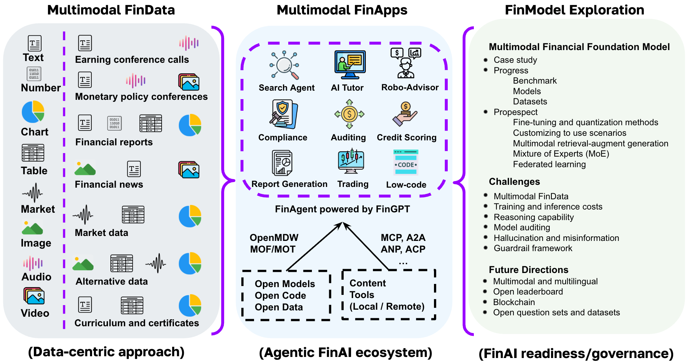

# Multimodal Financial Foundation Models (MFFMs): Progress, Prospects, and Challenges 🔥🔥🔥

  
**A Survey on Multimodal Financial Foundation Models**  

  

## 📰 News

+ [Nosa Capital's YouTube](https://www.youtube.com/watch?v=d2S_qugEbMQ)
+ [PodBean's Podcast](https://kathrynj2.podbean.com/e/multimodal-financial-foundation-models-a-paper-review/)
  
**📢 Update (Date: 03-01-2025)**
🚀 We released MFFMs [Documentation](https://awesome-mffms.readthedocs.io/en/latest/#)  

**📢 Update (Date: 11-15-2024)**
🚀 We host the 1st International Workshop on Multimodal Financial Foundation Models (MFFMs) @ ICAIF'24
[Workshop Page](https://sites.google.com/view/iwmffm2024/home?authuser=1)

## 📖 Table of contents
- [Awesome Papers](#awesome-papers)
  - [ Multimodal Financial Data](#multimodal-financial-data)
    - [ Earnings Conference Calls](#earnings-conference-calls)
    - [ Monetary Policy Conference](#monetary-policy-conference)
    - [Financial Reports](#financial-reports)
    - [Financial News](#financial-news)
    - [Market Data](#market-data)
    - [Climate Data for Commodity Trading](#climate-data-for-commodity-trading)
    - [Financial Curriculum and Certificates](#financial-curriculum-and-certificates)
  - [ Multimodal Financial Application](#multimodal-financial-application)
    - [AI search](#ai-search)
    - [AI tutor](#ai-tutor)
    - [Financial services](#financial-services)
    - [Auditing](#auditing)
    - [Report generation](#report-generation)
    - [Robo-advisor](#robo-advisor)
    - [AI compliance](#ai-compliance)
    - [Trading](#trading)
  - [Multimodal Financial Foundation Models](#multimodal-financial-foundation-models)

# Awesome Papers
## Multimodal Financial Data
### **Data-Centric Approach for Multimodal Financial Data**
#### Earnings Conference Calls
[4] [What You Say and How You Say It Matters: Predicting Financial Risk Using Verbal and Vocal Cues](https://aclanthology.org/P19-1038.pdf) ACL 2019. [Data](https://github.com/GeminiLn/EarningsCall_Dataset/tree/master)

[3] [HTML: Hierarchical Transformer-based Multi-task Learning for Volatility Prediction](https://dl.acm.org/doi/pdf/10.1145/3366423.3380128?casa_token=nczNU-7cmJ8AAAAA:f8QGb4OhlRADBCm6eNl2Zvuwd5B7WIWUTtsEkAcWum-ValjGaTGSyn7NoZcQ-MgiXN-SkdoQMNg5sw), WWW 2020. [Code](https://github.com/YangLinyi/HTML-Hierarchical-Transformer-based-Multi-task-Learning-for-Volatility-Prediction).

[2] [MAEC: A Multimodal Aligned Earnings Conference Call Dataset for Financial Risk Prediction](https://dl.acm.org/doi/pdf/10.1145/3340531.3412879), CIKM 2020. [Data](https://github.com/Earnings-Call-Dataset/MAEC-A-Multimodal-Aligned-Earnings-Conference-Call-Dataset-for-Financial-Risk-Prediction)

[1] [ECC Analyzer: Extracting Trading Signal from Earnings Conference Calls using Large Language Model for Stock Volatility Prediction](https://dl.acm.org/doi/pdf/10.1145/3677052.3698689), ICAIF 2024.

#### Monetary Policy Conference
[2] [MONOPOLY: Financial Prediction from MONetary POLicY Conference Videos Using Multimodal Cues](https://dl.acm.org/doi/pdf/10.1145/3503161.3548380?casa_token=HGG8_xUXqgYAAAAA:KKB772yfPxxsIo5IhIrZfeEffMkomYa-KYvHt7p7F3awe1bManRzorGFAqrdckPXkjSdMafYLgAdRQ), Multimedia 2022. [Code](https://github.com/monopoly-monitory-policy-calls/MONOPOLY)

[1] [Modal-adaptive Knowledge-enhanced Graph-based Financial Prediction from Monetary Policy Conference Calls with LLM](https://arxiv.org/pdf/2403.16055), FinNLP Workshop 2024.  [Code](https://github.com/OuyangKun10/MANAGER)

#### Financial Reports
[2] [Attentive statement fraud detection: Distinguishing multimodal financial data with fine-grained attention](https://www.sciencedirect.com/science/article/pii/S0167923622001841?casa_token=H5JWNW5xkkIAAAAA:ieMEzMom76ojHKJGekhrh5uBokT2FtYBAWVhBu406vu46YiO_p3jc8OE9EBa3Q91anUykV9s5x4), Decision Support System 2023.

[1] [XBRL-Agent: Leveraging large language models for financial report analysis](https://dl.acm.org/doi/pdf/10.1145/3677052.3698614?casa_token=eFzOiTLZuGkAAAAA:SNON8hhKqSXmkTASdYeemnJ-6z_QGMufywoaTNEzrqtf8-ylo6sjHIIcvScIafgWdAyq0RUCUx25jQ), ICAIF 2024. [Code](https://github.com/Open-Finance-Lab/Chat_XBRL)

#### Financial News
[1] [Analyzing Cascading Outbreak of GameStop Event: A Practical Approach Using Network Analysis and Large Language Models](https://dl.acm.org/doi/pdf/10.1145/3677052.3698636?casa_token=8IWUicpVTmUAAAAA:9RUD7Btk7kf30IAQdRN1GoF0L1_SZNLJ_MgpYl4TD-iM1lzBDW3LT4_EDjis2LoMeWaCHKqBQNKC6A), ICAIF 2024.

#### Market Data
[2] [FinRL: A deep reinforcement learning library for automated stock trading in quantitative finance](https://github.com/AI4Finance-Foundation/FinRL), Deep Reinforcement Learning Workshop @ NeurIPS 2020. [Code](https://github.com/AI4Finance-Foundation/FinRL) 

[1][FinRL-Meta: Market Environments and Benchmarks for Data-Driven Financial Reinforcement Learning](https://proceedings.neurips.cc/paper_files/paper/2022/file/0bf54b80686d2c4dc0808c2e98d430f7-Paper-Datasets_and_Benchmarks.pdf), NeurIPS 2022. [Code](https://github.com/AI4Finance-Foundation/FinRL-Meta)

#### Climate Data for Commodity Trading
...

#### Financial Curriculum and Certificates
[1] [High-Quality Financial Benchmark (QFinBen): Can LLMs Earn Degrees and Certificates?](), Multimodal Financial Foundation Models Workshop @ ICAIF 2024.

## Multimodal Financial Applications
### **Multimodal Financial Applications: MFFM-powered Agentic AI Ecosystem**
#### AI search
[2] [Enhancing Financial Sentiment Analysis via Retrieval Augmented Large Language Models](https://dl.acm.org/doi/pdf/10.1145/3604237.3626866?casa_token=R-mGG04P4qIAAAAA:II3kmTzRmD-fOnRBk_X2ieaeUzsS4m_CWl8vGOQNa0u4ks7CxcZduHD9ymqRCyfxjpZG4kyjg7dPKA), ICAIF 2023.

[1] [Customized fingpt search agents using foundation models](https://dl.acm.org/doi/pdf/10.1145/3677052.3698637?casa_token=3R8UeJJ3L68AAAAA:E_ElzSkM9Nu3TDIr-JlhZkS2vG-5kD2uoAN6PKMz-erSh-s-rcpwjwkzGoyGz95sbI0oE_84ziF9Sw), ICAIF 2024. [Code](https://github.com/Open-Finance-Lab/FinGPT-Search-Agent)

#### AI tutor
[1] [High-Quality Financial Benchmark (QFinBen): Can LLMs Earn Degrees and Certificates?](), Multimodal Financial Foundation Models Workshop @ ICAIF 2024.

#### Financial services

#### Auditing

#### Report generation

#### Robo-advisor

#### AI compliance
[1] [A Report on Financial Regulations Challenge at COLING 2025](https://arxiv.org/pdf/2412.11159)

#### Trading
[2] [FinMem: A performance-enhanced LLM trading agent with layered memory and character design](https://openreview.net/pdf?id=sstfVOwbiG), LLM-Agent Workshop @ ICLR 2024. [Code](https://github.com/pipiku915/FinMem-LLM-StockTrading)

[1] [FINCON: A Synthesized LLM Multi-Agent System with Conceptual Verbal Reinforcement for Enhanced Financial Decision Making](https://proceedings.neurips.cc/paper_files/paper/2024/file/f7ae4fe91d96f50abc2211f09b6a7e49-Paper-Conference.pdf), NeurIPS 2024. [Code](https://github.com/The-FinAI/FinCon)

## Multimodal Financial Foundation Models
[3] [Open-FinLLMs: Open Multimodal Large Language Models for Financial Applications](https://arxiv.org/pdf/2408.11878)

[2] [FinTral: A Family of GPT-4 Level Multimodal Financial Large Language Model](https://aclanthology.org/2024.findings-acl.774/) 

[1] [FinVis-GPT: A multimodal large language model for financial chart analysis.](https://arxiv.org/pdf/2308.01430)

