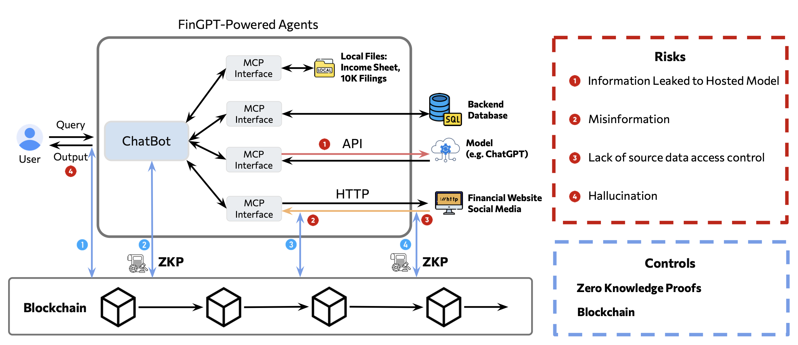

=================================
Opportunities
=================================

Guardrail Framework for FinAgents
=================================
Wide adoption of financial agents raises concerns about privacy, security, and trust. We first outline the potential risks inherent in financial agent workflows. Then, we propose a guardrail framework that leverages zero-knowledge proofs (ZKPs) and blockchain technology. Blockchain and ZKPs ensure that financial agents’ actions remain secure, verifiable, and immutable, fostering transparency and trust.

   