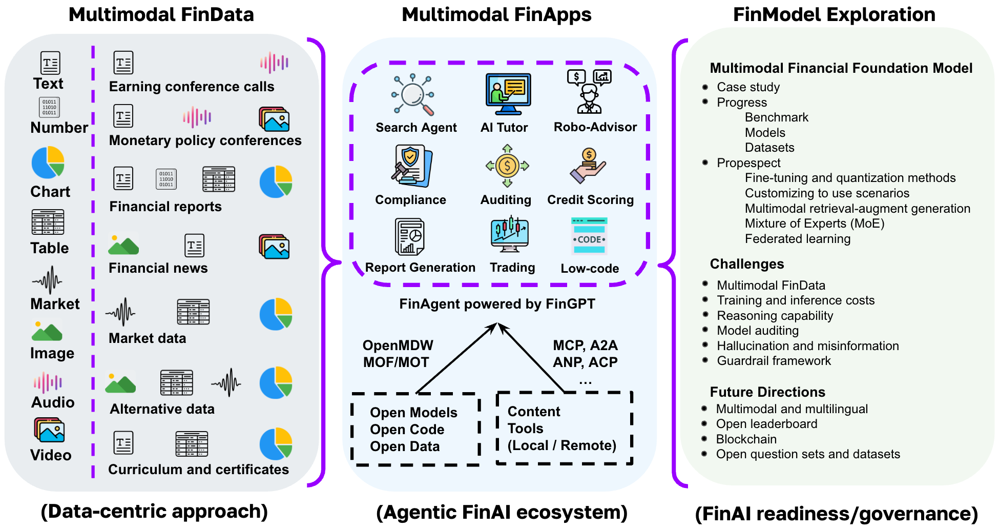

=============================
Overview
=============================

Welcome to the Multimodal Financial Foundation Models (MFFMs)!

Financial Large Language Models (FinLLMs), such as open FinGPT and proprietary BloombergGPT, have demonstrated great potential in select areas of financial services.
Beyond this earlier language-centric approach, Multimodal Financial Foundation Models (MFFMs) can digest interleaved multimodal financial data, including fundamental data, market data, data analytics, macroeconomic, and alternative data (e.g., natural language, audio, images, and video). 
In this webpage, we describe the progress, prospects, and challenges of MFFMs. We highlights ongoing research in the SecureFinAI Lab at Columbia University. We believe that MFFMs will enable a deeper understanding of the underlying complexity associated with numerous financial tasks and data, streamlining the operation of financial services and investment processes. 

   Figure is an overview of MFFMs. Multimodal financial data (left block) is ubiquitous in business and finance applications (middle block), such as search, tutor, robo-advisor, compliance, auditing, trading, etc. However, several major challenges (right block) call for immediate actions, in order to achieve financial AI readiness and governance.

