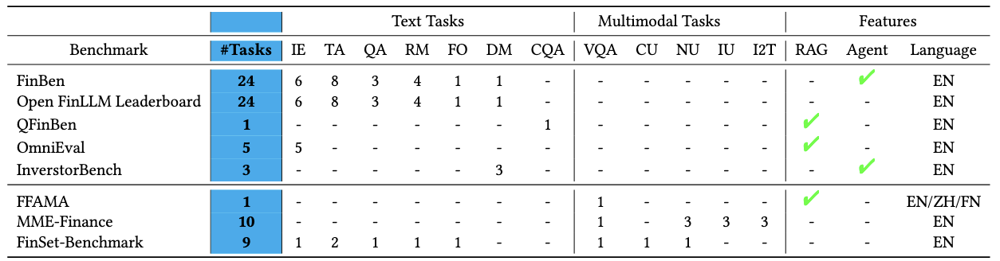

=================================
Benchmark
=================================

### **Benchmark**

- Legend

  - Text tasks – IE (Information Extraction), TA (Text Analysis), QA (Question Answering), RM (Risk Management), FO (Forecasting), DM (Decision-Making), CQA (Complex Question Answering).

  - Multimodal tasks – VQA (Visual Question Answering), CU (Chart Understanding), NU (Numeral Understanding), IU (Image Understanding), I2T (Image-to-Text).

  - Features – RAG (Retrieval-Augmented Generation), Agent (in-benchmark agent evaluation).

  - “✓” = capability present; “-” = not covered.