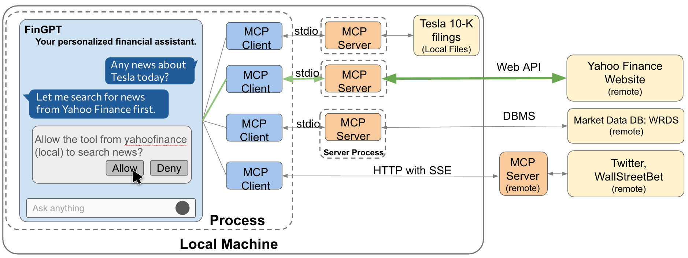

=================================
Multimodal Financial Applications: Agentic AI Ecosystem
=================================

FinAgents Powered by FinGPT
=============================
We envision that AI agents will enable learning systems to take action by observing the complex environment through iterative self-improvement. This capability could assist in addressing more complex real-world financial tasks. Our SecureFinAI Lab at Columbia has developed several prototypes of FinAgents, powered by FinGPT: search agent, tutor agent, XBRL agent, and FinRL trading agents.  

   The FinAgent framework powered by FinGPT and Model Context Protocol.

FinGPT search agent can quickly retrieve multimodal financial data customized to the specific needs of individual users or institutional investors and generate personalized content. The above Figure provides a generic framework of the FinGPT-powered agents. Interaction begins through a user interface where users input inquiries. Then, the agent will call different MCP clients accordingly to communicate via standard input/output with the corresponding MCP servers. 

These MCP servers handle different functions such as: 1) accessing local financial files; 2) searching financial news from remote services like Yahoo Finance through Web APIs; 3) querying market data from databases; 4) analyzing the market sentiment from social platforms like Twitter and Reddit/WallStreetBets. The framework emphasizes user-controlled permissions, explicitly asking for authorization before accessing external data sources, thus maintaining transparency and user privacy. MCP includes local and remote interactions, with remote servers interacting through the networking protocol (HTTP with SSE), ensuring real-time data updates.